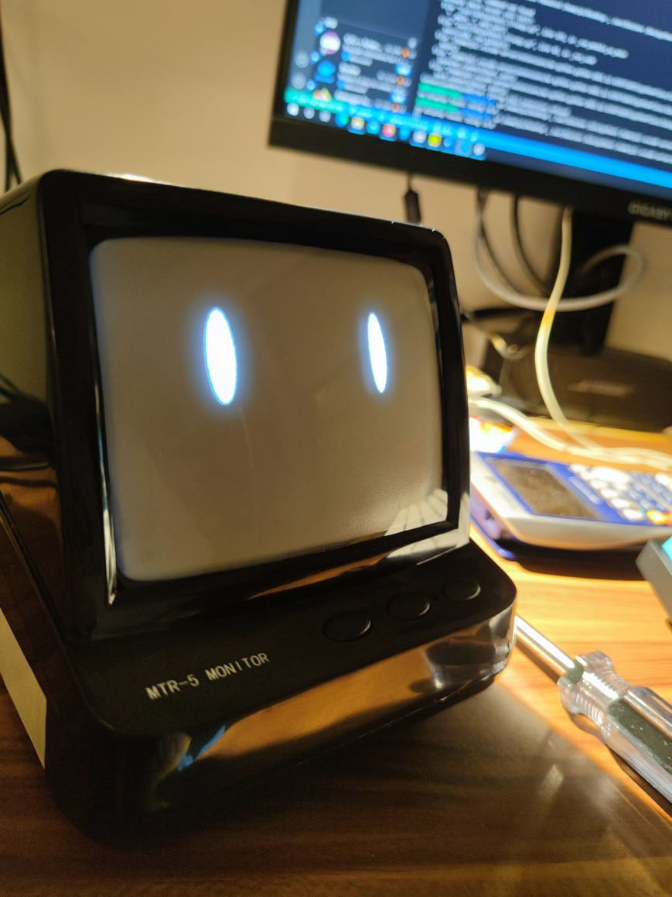

# OwO
Cutified CRT Project

## Image

## What is this
The Cutified CRT Project focus on creating a GUI for mini CRT displays. The project creates a face and other visuals on the display to make these vintage techs a piece of art.

The project started as uMouse's one day build after the finals, since he was so much into these retro devices at that time.

## Hardwares
- Raspberry Pi 3B+
- 14cm Desktop CRT Display

Note that the hardwares listed above are the ones tested, theoratically any compatible hardware could work.

## Features
- [x] Cute
- [x] Blinking eyes
- [x] Random talks
- [ ] Audio visualizator
- [ ] Daily tasks
- [ ] In sync with Outlook
- [ ] Email Notifications
- [ ] Clock

## Dependencies
- Python 3.x
- tkinter